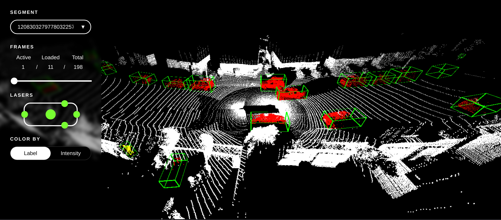

# Waymo Open Dataset Viewer

A WebGL viewer for pointclouds of the [waymo open dataset](https://waymo.com/open) that runs seamlessly in the browser with an integrated python server that processes and serves the dataset segments.



## Prerequisites

### Dataset  
Before using the viewer, you first need to download (parts of) the dataset from the [official download page](https://waymo.com/open/licensing/). Create a directory containing the segments (.tfrecord files) you want to view.

#### Install tensorflow (2.0.0)
Consider using tensorflow-gpu since it will speed up reading the segments.

#### Install dependencies

Server dependencies:
```
pip install -r requirements.txt
```
Frontend dependecies:  
```
yarn install
```

## Usage 

Start the websocket that processes and serves the segment files in a given directory:
```
python websocket.py --segments-dir path/to/segments
```

Build the frontend.
```
yarn build
```

Now, you can open the `index.html` file in the browser or call
```
yarn serve
```
to start a small python server on port 8000 that serves the html file.
